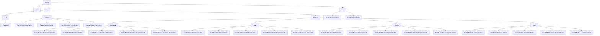

GitHub Copilot: # Evently Project

## Overview

Evently is a modular application designed to manage events, tickets, and attendance. The project is structured into several modules, each responsible for a specific domain of the application. This README provides an overview of the project structure and the purpose of each module.

## Project Structure

The project is organized into the following directories:

```
Evently/
├── .dockerignore
├── .editorconfig
├── .files/
│   ├── evently-realm-export.json
├── Directory.Build.props
├── docker-compose.dcproj
├── docker-compose.override.yml
├── docker-compose.yml
├── Evently_V_2_1.postman_collection.json
├── Evently_V_2.postman_collection.json
├── Evently.sln
├── Evently.sln.DotSettings
├── Evently.sln.DotSettings.user
├── launchSettings.json
├── src/
│   ├── API/
│   │   └── Evently.Api/
│   ├── Common/
│   │   ├── Evently.Common.Application/
│   │   ├── Evently.Common.Domain/
│   │   ├── Evently.Common.Infrastructure/
│   │   └── Evently.Common.Presentation/
│   ├── Modules/
│   │   ├── Attendance/
│   │   │   ├── Evently.Modules.Attendance.Application/
│   │   │   ├── Evently.Modules.Attendance.Domain/
│   │   │   ├── Evently.Modules.Attendance.Infrastructure/
│   │   │   ├── Evently.Modules.Attendance.IntegrationEvents/
│   │   │   └── Evently.Modules.Attendance.Presentation/
│   │   ├── Events/
│   │   │   ├── Evently.Modules.Events.Application/
│   │   │   ├── Evently.Modules.Events.Domain/
│   │   │   ├── Evently.Modules.Events.Infrastructure/
│   │   │   ├── Evently.Modules.Events.IntegrationEvents/
│   │   │   └── Evently.Modules.Events.Presentation/
│   │   ├── Ticketing/
│   │   │   ├── Evently.Modules.Ticketing.Application/
│   │   │   ├── Evently.Modules.Ticketing.Domain/
│   │   │   ├── Evently.Modules.Ticketing.Infrastructure/
│   │   │   ├── Evently.Modules.Ticketing.IntegrationEvents/
│   │   │   └── Evently.Modules.Ticketing.Presentation/
│   │   └── Users/
│   │       ├── Evently.Modules.Users.Application/
│   │       ├── Evently.Modules.Users.Domain/
│   │       ├── Evently.Modules.Users.Infrastructure/
│   │       ├── Evently.Modules.Users.IntegrationEvents/
│   │       └── Evently.Modules.Users.Presentation/
├── test/
│   ├── Evently.ArchitectureTests/
│   └── Evently.IntegrationTests/
```

### Directory Breakdown

- **.files/**: Contains configuration files and exports.
- **src/**: Contains the source code for the application.
  - **API/**: Contains the main API project.
    - **Evently.Api/**: The entry point for the API.
  - **Common/**: Contains shared code used across multiple modules.
    - **Evently.Common.Application/**: Application-level shared code.
    - **Evently.Common.Domain/**: Domain-level shared code.
    - **Evently.Common.Infrastructure**: Infrastructure-level shared code.
    - **Evently.Common.Presentation/**: Presentation-level shared code.
  - **Modules/**: Contains the different modules of the application.
    - **Attendance/**: Manages attendance-related functionality.
      - **Evently.Modules.Attendance.Application/**: Application layer for attendance.
      - **Evently.Modules.Attendance.Domain/**: Domain layer for attendance.
      - **Evently.Modules.Attendance.Infrastructure/**: Infrastructure layer for attendance.
      - **Evently.Modules.Attendance.IntegrationEvents/**: Integration events for attendance.
      - **Evently.Modules.Attendance.Presentation/**: Presentation layer for attendance.
    - **Events/**: Manages event-related functionality.
      - **Evently.Modules.Events.Application/**: Application layer for events.
      - **Evently.Modules.Events.Domain/**: Domain layer for events.
      - **Evently.Modules.Events.Infrastructure/**: Infrastructure layer for events.
      - **Evently.Modules.Events.IntegrationEvents/**: Integration events for events.
      - **Evently.Modules.Events.Presentation/**: Presentation layer for events.
    - **Ticketing/**: Manages ticketing-related functionality.
      - **Evently.Modules.Ticketing.Application/**: Application layer for ticketing.
      - **Evently.Modules.Ticketing.Domain/**: Domain layer for ticketing.
      - **Evently.Modules.Ticketing.Infrastructure/**: Infrastructure layer for ticketing.
      - **Evently.Modules.Ticketing.IntegrationEvents/**: Integration events for ticketing.
      - **Evently.Modules.Ticketing.Presentation/**: Presentation layer for ticketing.
    - **Users/**: Manages user-related functionality.
      - **Evently.Modules.Users.Application/**: Application layer for users.
      - **Evently.Modules.Users.Domain/**: Domain layer for users.
      - **Evently.Modules.Users.Infrastructure/**: Infrastructure layer for users.
      - **Evently.Modules.Users.IntegrationEvents/**: Integration events for users.
      - **Evently.Modules.Users.Presentation/**: Presentation layer for users.
- **test/**: Contains the test projects.
  - **Evently.ArchitectureTests/**: Architecture tests for the project.
  - **Evently.IntegrationTests/**: Integration tests for the project.

## Modular Architecture

Evently follows a modular monolith architecture, which allows for a clear separation of concerns and better maintainability. Each module is self-contained and encapsulates its own domain logic, which makes it easier to manage and scale the application.

### Benefits of Modular Architecture

- **Separation of Concerns**: Each module is responsible for a specific domain, reducing the complexity of the codebase.
- **Scalability**: Modules can be developed, tested, and deployed independently, allowing for easier scaling of the application.
- **Maintainability**: With a clear separation of concerns, the codebase is easier to maintain and extend.
- **Reusability**: Common functionality can be shared across modules, promoting code reuse.

### Module Structure

Each module in Evently follows a similar structure:

- **Application**: Contains the application logic and services.
- **Domain**: Contains the domain entities and business logic.
- **Infrastructure**: Contains the infrastructure-related code, such as data access and external integrations.
- **IntegrationEvents**: Contains the integration events for the module.
- **Presentation**: Contains the presentation layer, such as controllers and views.

## Diagram



## Getting Started

To get started with the project, follow these steps:

1. Clone the repository.
2. Open the solution file

Evently.sln

in Visual Studio. 3. Build the solution to restore the NuGet packages. 4. Run the project using the Visual Studio debugger or the command line.

## Contributing

We welcome contributions to the project. Please follow the guidelines in the `CONTRIBUTING.md` file.

## License

This project is licensed under the MIT License. See the `LICENSE` file for more details.

## Contact

For any questions or inquiries, please contact the project maintainers.

---

This README provides a high-level overview of the project structure and should help you navigate the codebase effectively.
